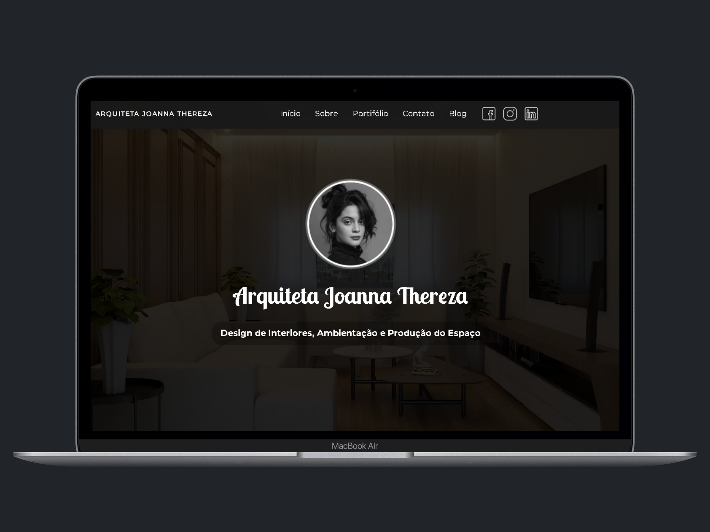
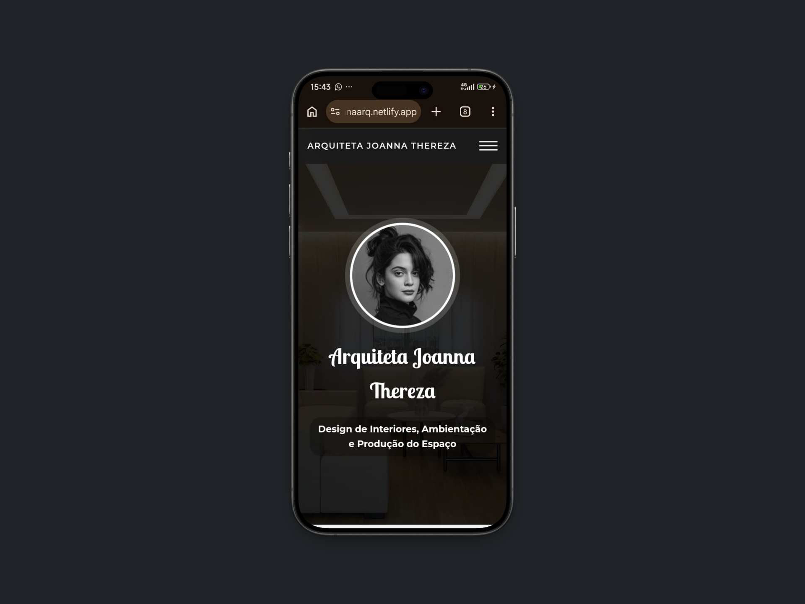

# 📐 Projeto: Website Institucional para Arquiteta
🔗 **Deploy:** https://joannaarq.netlify.app  

## 🖼️ Preview do Projeto

  
  

---

## 🧠 Sobre o Projeto

Este projeto representa meu primeiro desenvolvimento real do segmento de arquitetura. A proposta consistiu na criação de um website institucional com foco em performance visual, organização estrutural e apresentação estratégica de conteúdo.

A aplicação foi projetada para valorizar o portfólio da profissional, priorizando a exibição de projetos por meio de recursos visuais otimizados, além de proporcionar uma experiência de navegação alinhada aos padrões estéticos e funcionais da área.

---

## 🎯 Objetivo

- Estabelecer presença digital profissional  
- Estruturar a apresentação de projetos de forma clara e escalável  
- Reforçar identidade visual e percepção de autoridade  
- Facilitar o contato com potenciais clientes  
- Implementar uma seção de blog para publicação de artigos, estudos e conteúdos educativos relacionados à arquitetura  

---

## ⚙️ Funcionalidades

- Seção inicial com destaque para projetos (banner + portfólio em evidência)  
- Página de apresentação institucional  
- Galeria de projetos com organização visual estruturada  
- Suporte à exibição de vídeos integrados  
- Layout responsivo com adaptação para diferentes breakpoints  
- Estrutura de código preparada para escalabilidade  

---

## 🛠️ Tecnologias Utilizadas

- HTML5 (estrutura semântica)  
- CSS3 (estilização e responsividade)  
- JavaScript (interações e manipulação de elementos)  
- Git e GitHub (versionamento de código)  

---

## 🎨 Foco em Design

Considerando o contexto da arquitetura, o desenvolvimento priorizou:

- Otimização de imagens (compressão e formatos modernos, mantendo alta qualidade visual)  
- Consistência no espaçamento e organização (layout clean e bem distribuído)  
- Hierarquia visual para melhor leitura e navegação  
- Experiência do usuário (UX) orientada à valorização do portfólio  

---

## 📱 Responsividade

A interface foi desenvolvida com abordagem responsiva, garantindo compatibilidade entre dispositivos desktop e mobile, com ajustes de layout baseados em diferentes resoluções de tela.

---

## 🚧 Desafios Enfrentados

- Balanceamento entre qualidade visual e performance no carregamento de imagens  
- Estruturação de layout mantendo consistência estética e organização de código  
- Integração de vídeos sem comprometer o fluxo visual da página  
- Implementação de responsividade para múltiplos dispositivos  
- Manipulação dinâmica de elementos via JavaScript  
- Modularização do CSS para evitar conflitos e facilitar manutenção  

---

## 📈 Aprendizados

Durante o desenvolvimento, foram consolidados conceitos como:

- Estruturação semântica e organização de projetos front-end  
- Aplicação prática de responsividade  
- Integração entre design e desenvolvimento  
- Resolução de problemas reais em ambiente de produção  
- Importância da experiência do usuário na construção de interfaces  

Este projeto também proporcionou a primeira experiência com demandas reais, exigindo maior responsabilidade técnica e visão estratégica.

---

## 💡 Considerações Finais

Este projeto marca o início da minha atuação prática no desenvolvimento web com aplicação em cenário real. O foco foi construir uma solução funcional, visualmente consistente e tecnicamente organizada.

Além do aspecto técnico, o desenvolvimento exigiu compreensão de como alinhar tecnologia, estética e objetivo do cliente em um único produto digital.

---

## 📬 Contato

Disponível para feedbacks, melhorias e oportunidades de colaboração.

---

